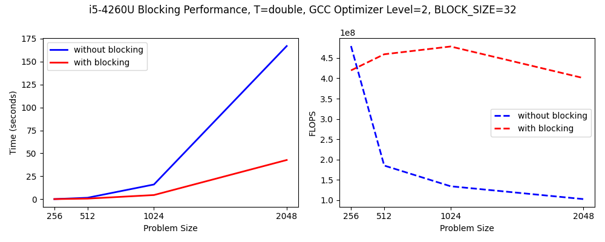

# Bench Matrix-Matrix

**Version:** 1.0.0

**Release date:** 17 Jan 2024

This a benchmark that calculates floating point operations per second (flops) by first computing a matrix-matrix product. This is a c++ rewrite from an experiment conducted with Prof. Andrew Targhetta at the University of New Mexico.

Bench Matrix-Matrix depends on [P3A](https://github.com/sandialabs/p3a) for its data types,
and [GoogleTest](https://github.com/google/googletest) for its testing interface.
